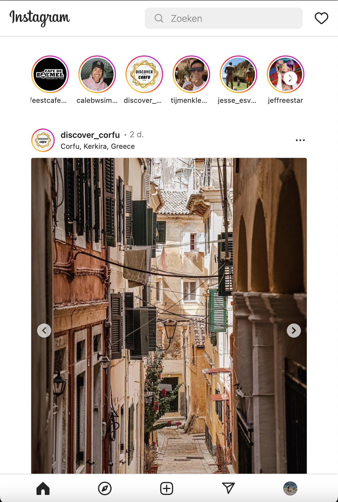
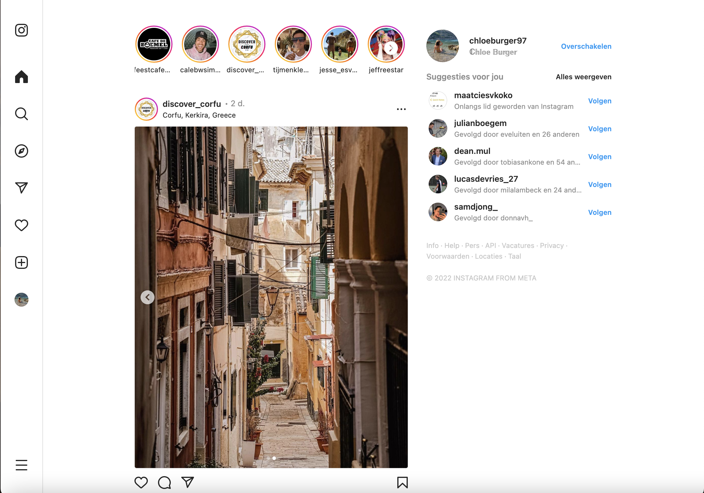
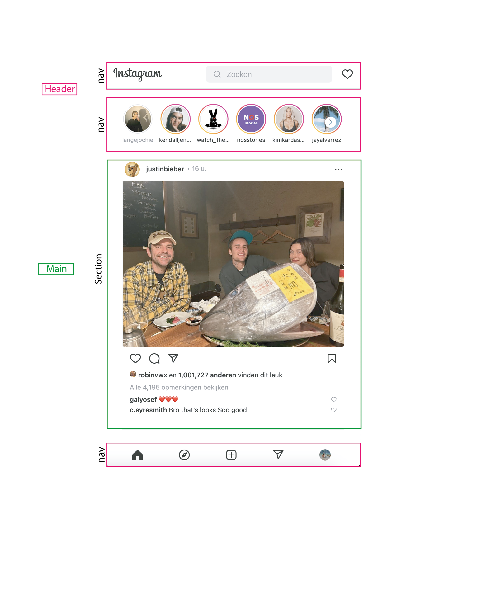
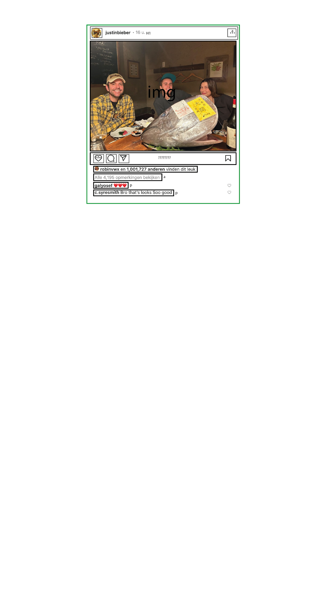
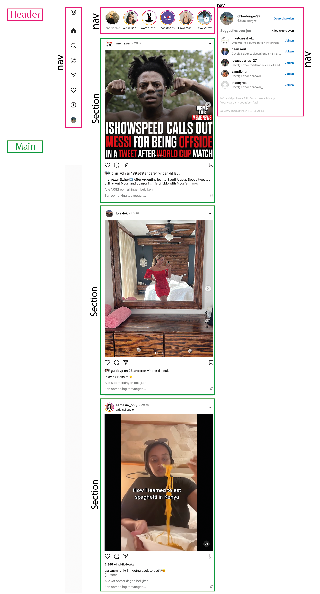
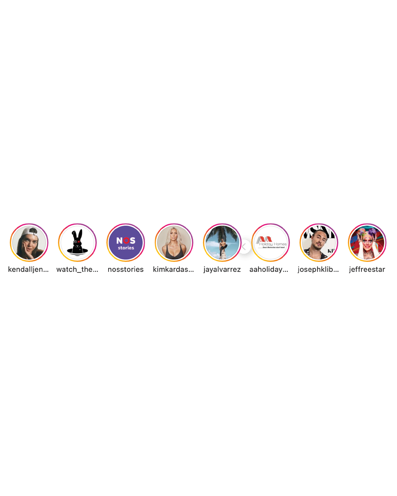
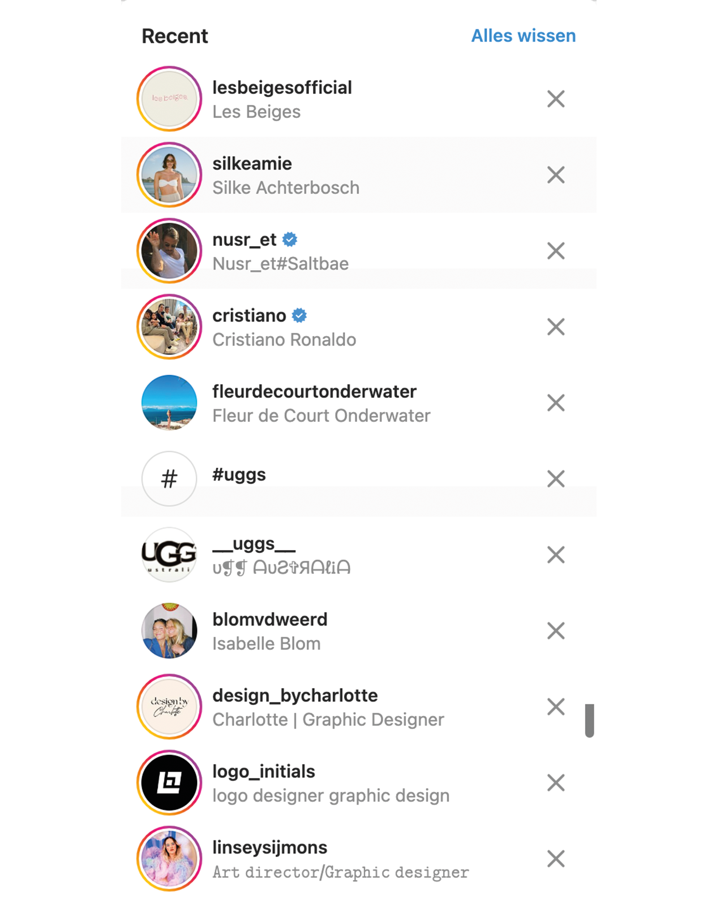
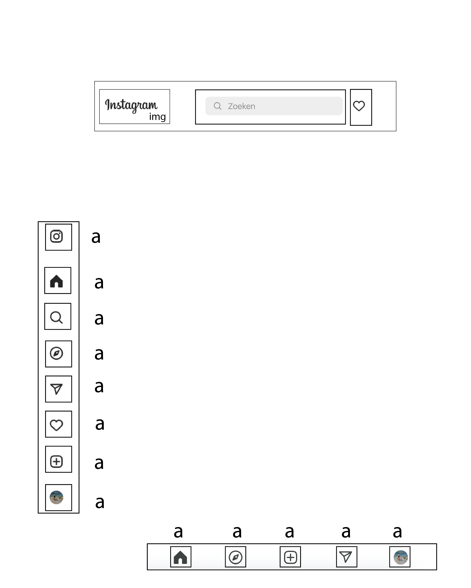

# Procesverslag
Markdown is een simpele manier om HTML te schrijven.  
Markdown cheat cheet: [Hulp bij het schrijven van Markdown](https://github.com/adam-p/markdown-here/wiki/Markdown-Cheatsheet).

Nb. De standaardstructuur en de spartaanse opmaak van de README.md zijn helemaal prima. Het gaat om de inhoud van je procesverslag. Besteedt de tijd voor pracht en praal aan je website.

Nb. Door *open* toe te voegen aan een *details* element kun je deze standaard open zetten. Fijn om dat steeds voor de relevante stuk(ken) te doen.

## Jij

  
uitwerken voor kick-off werkgroep

  ### Auteur:
  Chloé

  #### Je startniveau:
  tussen blauw en rood

  #### Je focus:
  responsive
 

## Je website

  
uitwerken voor kick-off werkgroep

  ### Je opdracht:
  https://www.instagram.com/

  #### Screenshot(s) van de eerste pagina (small screen): 
  Homepagina Instagramfeed 
  

  #### Screenshot(s) van de tweede pagina (small screen):
  Homepagina Instagramfeed  
  
 

## Toegankelijkheidstest 1/2 (week 1)

  
uitwerken na test in 1e werkgroep

  ### Bevindingen
  <ul>
  <li>Geen duidelijke hierarchie</li>
  <li>Bij gebruik van screenreader is de pagina niet goed toegankelijk</li>
  </ul>
  
  #### Screenreader
  Je kan niet snel vanuit de stories verder selecteren met de screenreader.
  Dit komt omdat er slecht gebruikt wordt gemaakt van een duidelijke hierarchie. De storie sectie heeft bijvoorbeeld overal hetzelfde kopje waardoor er geen onderscheid wordt gemaakt met het kopje van de stories en de daadwerkelijk stories.

  <b>Oplossing:</b> Dit probleem kan worden opgelost door ervoor te zorgen dat de stories een kopje krijgen die je kan selecteren om in te navigeren. Pas wanneer je de selectie hebt gemaakt kan je door de stories tabben. Deze stories hebben een ander kopje dan het kopje van de stories.
  
  <li>Kleine pagina: Wanneer je tabt na de zoekbalk ga je door alle zoeksuggesties.</li>
  <b>Oplossing:</b>
  Dit kan je aanpassen door pas de zoekfunctie beschikbaar te maken wanneer de zoekfunctie geselecteerd wordt.
   
  <li>Grote pagina: Wanneer er wordt getabt door de pagina begin je bij de stories.</li>
  <b>Oplossing:</b> Dit zou moeten beginnen met de navigatiebalk van de pagina. Dit pas je aan door in de header duidelijke hierarchie te geven aan de kopjes van de navigatie.
 
  #### Muis en Toetsenbord
  Geen beperkingen aantoonbaar
  
  #### Motoriek (shocks, elastiekjes)
  Geen beperkingen aantoonbaar

  #### Visueel (brillen, contrast, kleurenblind, dark/light). 
  Geen beperkingen aantoonbaar

## Breakdownschets (week 1)

  
uitwerken na afloop 2e werkgroep

  ### de hele pagina klein: 
  
  

  ### de hele pagina groot: 
  

  ### dynamisch deel (carrousel): 
  

  ### wellicht nog een dynamisch deel (zoekfunctie 2 versies): 
  
  

## Voortgang 1 (week 2)

  
uitwerken voor 1e voortgang

  ### Stand van zaken
  hier dit ging goed & dit was lastig (neem ook screenshots op van delen van je website en code)

  ### Agenda voor meeting
  samen met je groepje opstellen

  Guido: Hoe verberg he de H1 voor screenreader en hoe laat je een button mee schuiven met de afbeelding?

  Lynn: Wat is de beste manier om een slider in je website te impementeren die responsive ook goed werkt?

  Chloe: Hoe kan je de navbar hergroeperen als de site groter wordt?

  ### Verslag van meeting
  hier na afloop snel de uitkomsten van de meeting vastleggen

  - Geen li gebruiken in de navbar bij elke navbar, zet een a voor de images.
  - Nav ul gebruiken.
  - @media in css gebruiken om de derde nav te voorschijn te krijgen vanaf een minimum breedte.

## Voortgang 2 (week 3)

  
uitwerken voor 2e voortgang

  ### Stand van zaken
  De layout met css ging best wel goed. Ik merk dat ik wel nog soms moeite heb om de juiste parent te benoemen.
  Dit lukt wel na enige tijd beter. 

  ### Agenda voor meeting
  samen met je groepje opstellen

 Lynn: hoe maak je de buttons in de slider die ervoor zorgen dat je een ander kleur kunt selecteren?

 Chloe: - Hoe kan je ervoor zorgen dat de content continu dezelfde grote blijft bij het groter en kleiner maken van de pagina?
        - Hoe kan je in de carrousel pijltjes maken waar je op kan klikken om ze te kunnen navigeren?

  ### Verslag van meeting
  hier na afloop snel de uitkomsten van de meeting vastleggen

  - punt 1
  - punt 2
  - nog een punt
- ...

## Toegankelijkheidstest 2/2 (week 4)

  
uitwerken na test in 8e werkgroep

  ### Bevindingen
  Lijst met je bevindingen die in de test naar voren kwamen (geef ook aan wat er verbeterd is):

  #### Screenreader
  Hier korte omschrijving (met indien nodig afbeeldingen)

  Hier een omschrijving van hoe het opgelost kan worden (met indien nodig afbeeldingen)

  #### Muis en Toetsenbord 
  Hier korte omschrijving (met indien nodig afbeeldingen)

  Hier een omschrijving van hoe het opgelost kan worden (met indien nodig afbeeldingen)

  #### Motoriek (shocks, elastiekjes)
  Hier korte omschrijving (met indien nodig afbeeldingen)

  Hier een omschrijving van hoe het opgelost kan worden (met indien nodig afbeeldingen)

  #### Visueel (brillen, contrast, kleurenblind, dark/light). 
  Hier korte omschrijving (met indien nodig afbeeldingen)

  Hier een omschrijving van hoe het opgelost kan worden (met indien nodig afbeeldingen)

## Voortgang 3 (week 4)

  
uitwerken voor 3e voortgang

  ### Stand van zaken
  hier dit ging goed & dit was lastig (neem ook screenshots op van delen van je website en code)

  ### Agenda voor meeting
  samen met je groepje opstellen

  | student 1      | student 2          | student 3    | student 4        |
  | ---            | ---                | ---          | ---              |
  | dit bespreken  | en dit             | en ik dit    | en dan ik dat    |
  | en dat ook nog | dit als er tijd is | nog een punt | dit wil ik zeker |
  | ...            | ...                | ...          | ...              |

  ### Verslag van meeting
  hier na afloop snel de uitkomsten van de meeting vastleggen

  - punt 1
  - punt 2
  - nog een punt
  - ...

## Eindgesprek (week 5)

  
uitwerken voor eindgesprek

  ### Je uitkomst - karakteristiek screenshots:
  

  ### Dit ging goed/Heb ik geleerd: 
  Korte omschrijving met plaatjes

  

  ### Dit was lastig/Is niet gelukt:
  Korte omschrijving met plaatjes

  

## Bronnenlijst

  
continu bijhouden terwijl je werkt

  Nb. Wees specifiek ('css-tricks' als bron is bijv. niet specifiek genoeg).

  1. bron 1
  2. bron 2
  3. ...

